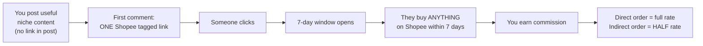
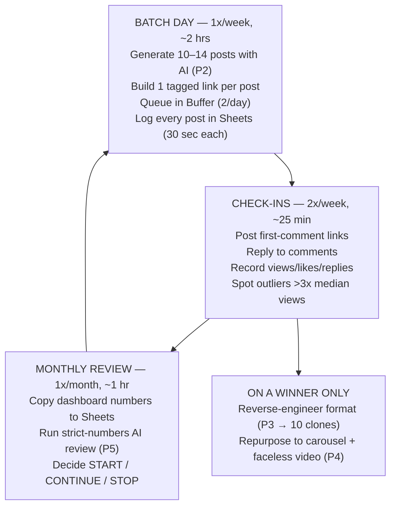
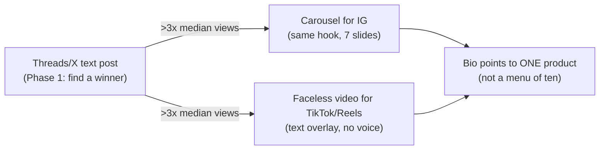
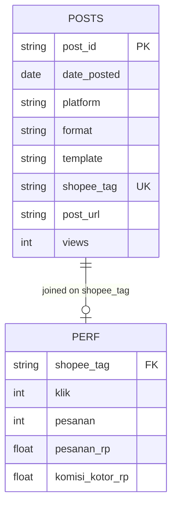

# Shopee Affiliate Organic Growth System (ID)

A low-maintenance side-income operating system for Indonesia's Shopee Affiliate program — built for someone with a day job, 3–5 hours per week, fully faceless, starting from zero.

> **One-line idea:** post genuinely useful niche content (link only in comments) → collect clicks → earn commission on anything the clicker buys within 7 days → use AI to clone whatever format works → repurpose winners to carousel + video → review monthly. Volume finds winners; AI scales them.

This repo is **not an app and not a bot**. It is a documented workflow: the plan you execute, the research that proves each claim, and the prompt templates you paste into Claude / GPT / GLM. No code to run, nothing to deploy.

---

## 1. Start here (2 minutes)

```
research/shopee-affiliate-workflow-plan.md     ← THE SYSTEM. Read this first, execute top to bottom.
research/shopee-affiliate-workflow-research.md ← THE EVIDENCE. 69 primary-source citations behind the plan.
```

If you read nothing else, read **plan §§8 + 10** (phased plan + start-today list). Everything below in this README is a map, not a replacement.

### Docs index — every guide, when to read it

| Doc | Read it when |
|---|---|
| [research/shopee-affiliate-workflow-plan.md](research/shopee-affiliate-workflow-plan.md) | Always first — the executable system, prompt kit P0–P7, checklists, troubleshooting |
| [research/shopee-affiliate-workflow-research.md](research/shopee-affiliate-workflow-research.md) | When you ask "says who?" — primary-source proof for every claim |
| [docs/glossary.md](docs/glossary.md) | Jargon hits (EPC, Komisi Kotor, indirect, tag, warm-up…) — keep open in a tab |
| [docs/choose-your-niche.md](docs/choose-your-niche.md) | Before committing to a niche, or opening a second account |
| [docs/content-examples.md](docs/content-examples.md) | Blank page — copy-adapt-post warm-up + linked examples, carousel included |
| [docs/monthly-review-example.md](docs/monthly-review-example.md) | Before your first P5 run — fictional worked join → verdicts |
| [docs/prompt-library.md](docs/prompt-library.md) | The 8 prompts P0–P7, canonical blocks + WHEN/INPUTS/OUTPUT/INTERPRET guides |
| [docs/faq.md](docs/faq.md) | Any "wait, how does X work?" moment — real setup questions, short answers |
| [tracking/posts.csv](tracking/posts.csv), [tracking/links.csv](tracking/links.csv), [tracking/performance_import.csv](tracking/performance_import.csv) | Day one — import straight into Google Sheets, delete the marked example rows |

---

## 2. How the money works (the 30-second model)



Three facts that shape the whole strategy:

| Fact | Implication |
|---|---|
| Per-item commission is tiny; indirect orders pay **half** rate | Optimize for **click volume**, not product picking. The product is nearly incidental. |
| ~0.5% of posts "hit" (working model, practitioner heuristic — not official) | Consistency beats any single post. ~2/day scheduled is the engine. |
| Shopee pays **weekly** (<Rp500rb via ShopeePay, ≥Rp500rb via bank, PPh tax withheld, KTP/NPWP required) | Monthly review is for *decisions*; money itself moves weekly. |

New to the vocabulary? Keep the [glossary](docs/glossary.md) open in a tab.

---

## 3. The weekly operating loop (what you actually do)



Total: **3–5 hrs/week**. Miss a day? The queue covers you — that is why a 2-day rolling buffer is a rule, not a tip.

---

## 4. The content pipeline (text first, everything else later)



Rules that are non-negotiable:

1. **Link lives only in the first comment**, never the post body (reach protection).
2. **One post = one tagged link** (`platform_account_content`, e.g. `th_a1_t042_txt`). Reusing tags destroys attribution.
3. **Fresh accounts warm up 7 days link-free** or get throttled.
4. **Never claim you tested what you didn't.** Say "ratingnya paling stabil…" / "komentar pembeli banyak bilang…".
5. **One niche, one template at a time** until 30 days of data. (Recommended start: small-space home living / kos-kosan hacks — faceless-native, impulse price band Rp20–150rb, carousel-friendly. Beauty is expansion lane #2. Framework: [choose-your-niche](docs/choose-your-niche.md). Stuck at a blank page? [content-examples](docs/content-examples.md).)

---

## 5. AI prompt kit (where the leverage is)

Full blocks + usage guides (trigger, exact inputs with examples, expected output, how to interpret) live canonically in the [prompt library](docs/prompt-library.md). Map:

| Prompt | When | Job |
|---|---|---|
| P0 — niche validation | Starting / second account | Score 3 candidates → 10-pain test → go/no-go |
| P1 — pain-point + idea bank | Niche chosen + monthly refresh | 15 pains → 30 post angles + Shopee search keywords |
| P2 — weekly batch | Every batch day | 12 posts (<400 chars) + keyword + first-comment line each |
| P3 — format lock-in ⭐ | Only on a >3x-median winner | Reverse-engineer hook/structure/emotion → 10 clones, same template |
| P4 — repurpose | Only on proven winners | 7-slide carousel + 20–30s faceless video from the same hook |
| P5 — monthly review | Monthly | Strict-numbers join of posts × Shopee data → START/CONTINUE/STOP + 5 next actions |
| P6 — flop autopsy | 5+ dead posts / monthly | Per-flop diagnosis + 1 rewrite each + shared pattern |
| P7 — reply drafts | Daily engagement | 3 in-voice reply options, no links |

⭐ P3 is the money workflow. Everything else exists to feed it winners.

---

## 6. Tracking (a spreadsheet, deliberately)


(Field names match [tracking/*.csv](tracking/posts.csv) exactly — the diagram shows the join columns; full column lists live in the CSV headers.)

Three tabs in one Google Sheet (10M cells — your year-one ~700 rows is a rounding error):

- **`posts`** — one row per post at scheduling time (30 sec/row).
- **`links`** — optional product catalog (from Phase 4).
- **`performance_import`** — monthly manual copy from Shopee's `Laporan Performa` (Klik, Pesanan, Produk Terjual, Pesanan Rp, Komisi Kotor Rp; refreshes 16:30 WIB). No official CSV export exists — anyone telling you otherwise is describing a different program.
- **Monthly view:** pivot `platform × format × template` → clicks, orders, commission, **EPC (commission ÷ clicks)**. EPC per tag drives START/CONTINUE/STOP. First time? Walk the [fictional worked example](docs/monthly-review-example.md) before touching real numbers.

A custom Postgres app was evaluated and **rejected**: Shopee already attributes by tag, so all you need is a VLOOKUP, not software. Revisit only if manual joins cost >1 hr/month for 3 straight months (triggers + fallback stack in plan §7).

---

## 7. Tool stack (all free tier — verify limits in-app at signup)

| Need | Pick | Why |
|---|---|---|
| Schedule Threads+X | **Buffer Free** | 3 channels, 10 queued/channel, Threads+X supported, free Start Page doubles as link-in-bio |
| Runner-up scheduler | Publer Free | 3 accounts, 10 pending/account; first-comment scheduling ambiguous on free — verify |
| Tracking | Google Sheets | Unlimited at this scale, CSV/join-native |
| Link-in-bio (Phase 4) | Beacons free (or Linktree free) | One page, ≤5 links |
| Carousel design | Canva Free | Reusable 7-slide template |
| Faceless video | CapCut Free | Text-overlay workflow, no voice needed |
| Brain | Any capable LLM (Claude / GPT / GLM) | Drafting, variations, overflow — use what you have |

Skipped on purpose: Later and Hootsuite (no free plan at all), Metricool free (20 posts/mo — too tight), paid trackers (Shopee tags already attribute), custom domain, stock sites.

---

## 8. Do this now (60 minutes, in order)

- [ ] **20 min** — Register Shopee Affiliate under your own account; open the link-builder + `Laporan Performa` screens; screenshot payout/tax panel.
- [ ] **2 min** — Write down your tag convention: `th_a1_t001_txt`. Never deviate.
- [ ] **20 min** — Create Threads + X faceless accounts; post 1 link-free value post each (warm-up starts today).
- [ ] **10 min** — Create the Google Sheet: import [tracking/posts.csv](tracking/posts.csv), [tracking/links.csv](tracking/links.csv), [tracking/performance_import.csv](tracking/performance_import.csv) as three tabs, delete the marked example rows.
- [ ] **8 min** — Run **P1** in Claude; save the idea bank to the Sheet.

Then follow **Phase 0 → 5** in the plan: setup → manual text loop (60–100 posts, find one 3x winner) → tracking live → AI-clone the winner → repurpose winners → monthly cadence.

### What the next 90 days look like

| When | Done looks like | Money |
|---|---|---|
| Day 7 | Warm-up complete, Sheet live, 5–10 tagged links banked (unposted) | Rp0 — expected |
| Day 30 | 40–60 posts logged, first dashboard copy done, P5 practiced on thin data | ~Rp0 — expected |
| Day 60–90 | 100–150 posts, first winner hunt active (P3 at first >3x outlier) | First small weekly payouts possible |
| Month 4+ | One proven template scaled + repurposed, monthly cadence running | Modest, hopefully consistent |

Stuck anywhere along the way? [FAQ](docs/faq.md) first, plan Appendix C second.

---

## 9. What the research proved (and corrected)

The playbook you studied was directionally right; primary sources corrected five things (full citations in the research file):

1. Payouts are **weekly**, not monthly — and indirect orders pay **half**.
2. "≥3 tags" is **convention, not a rule** — tags are real, limits are undocumented.
3. **No CSV export** exists on the affiliate dashboard — plan for manual monthly copy.
4. Paid ads aren't banned outright but **need Shopee's prior approval**; self-purchase, multi-accounts, and link-mass-blasting void commission.
5. No Meta/X document confirms link suppression — comments-only placement is a **hedge**, stated honestly.

Open unknowns (flagged, not fudged): per-category rate tables, individual-app status-tab names, Publer free first-comment tier, Threads new-account thresholds.

---

## 10. Repo map

```
ads-app/
├── README.md                              ← you are here (hub — every doc linked from §1)
├── docs/
│   ├── glossary.md                        ← jargon table (EPC, indirect, tag, warm-up…)
│   ├── choose-your-niche.md               ← 5-criteria framework + 3 niches scored + validation
│   ├── content-examples.md                ← warm-up + linked posts + carousel, copy-ready
│   ├── monthly-review-example.md          ← fictional P5 walkthrough (join → verdicts)
│   ├── prompt-library.md                  ← canonical P0–P7 blocks + usage guides
│   └── faq.md                             ← real setup questions, short answers
├── tracking/
│   ├── posts.csv                          ← import to Sheets tab `posts` (1 example row — delete it)
│   ├── links.csv                          ← import to Sheets tab `links`
│   └── performance_import.csv             ← import to Sheets tab `performance_import`
└── research/
    ├── shopee-affiliate-workflow-plan.md     ← execute this (Appendices B+C: check-in checklist + troubleshooting)
    └── shopee-affiliate-workflow-research.md ← evidence for this
```

No source code, no secrets, no credentials in this repo — by design. If Shopee links/tags ever get logged, they live in your private Google Sheet, not here.

---

*Disclaimer: side-income system, not financial advice. Commission rules, rates, and free-tier limits change — your own Shopee dashboard and each tool's pricing page override anything written here. Shopee, Threads, X, and all tool names are trademarks of their respective owners.*
